# MixMill beginner user guide

This guide explains MixMill from the beginning. No video-editing or server
knowledge is required for the Windows app.

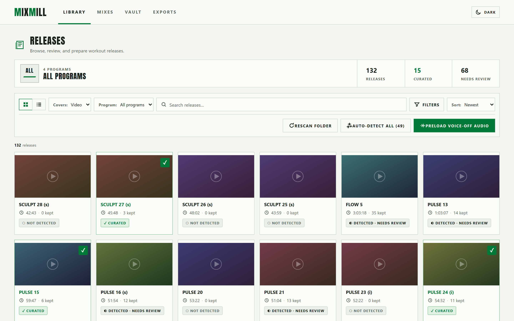

*The Library. Every release MixMill found, with its review state underneath.*

## 1. What MixMill is

MixMill creates custom workout-class mixes from media you already own.

It does not contain workout releases. It does not download them. You provide
your own video, music, and choreography-note files.

MixMill saves small database records describing each track:

- Track name
- Start time
- End time
- Matched music file
- Matching choreography pages

These records point to your original files. They are not duplicate media files.

### The four tabs

| Tab | What it holds |
| --- | --- |
| **Library** | Every release MixMill found, and the editor where you review tracks. |
| **Mixes** | Your mixes, plus the automatic generator. |
| **Vault** | Releases parked out of the way. |
| **Exports** | Finished files waiting to be downloaded. |

## 2. Install the Windows app

1. Download the latest `MixMill-*-Windows-x64-Setup.exe` from the
   [official releases page](https://github.com/nextthrive/mixmill-class-remixer/releases/latest).
2. Run the installer.
3. If Windows shows an **Unknown publisher** warning, confirm that the file came
   from the official release page and verify it with `SHA256SUMS.txt`.
4. Choose **More info → Run anyway**.
5. Open MixMill from the Start Menu.

MixMill installs only for your Windows account. It does not need administrator
access. Python, Docker, Git, and a terminal are not required.

## 3. Organize the media library

Use one folder for each program and one folder for each release.

```text
Workout Library/
└── BodyCombat/
    └── BodyCombat 92/
        ├── BODYCOMBAT92.mp4
        ├── BODYCOMBAT92ChoreographyNotes.pdf
        └── Music/
            ├── 01 Ready or Not.m4a
            ├── 02 Pum Pum.m4a
            ├── 03 Hope.m4a
            └── ...
```

Rules:

- Put the release video inside the release folder.
- Put the choreography PDF beside the video.
- Put music files inside a subfolder. The subfolder name does not matter.
- Use track numbers at the start of music filenames when possible.
- Keep only one copy of each file. MixMill does not require duplicates.

A release can work with only a video. Missing music prevents music matching.
Missing choreography notes prevents study-PDF mapping.

## 4. Choose and scan the library

First launch asks for your media folder. Choose the top-level folder—in the
example above, choose `Workout Library`.

Select **Rescan folder**. MixMill searches for supported video files and adds
each release to the Library.

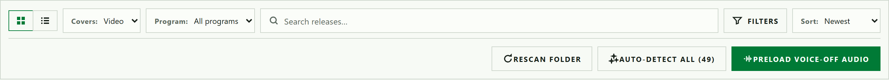

*Left to right: grid or list view, cover source, program filter, search, status
filters, sort. The buttons on the right act on the whole library.*

To choose a different folder later, use the Start Menu shortcut
**MixMill - Change Media Folder**.

### Finding one release among hundreds

- **Search** matches release titles as you type.
- **Program** narrows the library to one program.
- **Filters** narrows by review state.
- **Sort** orders by newest, title, or length.

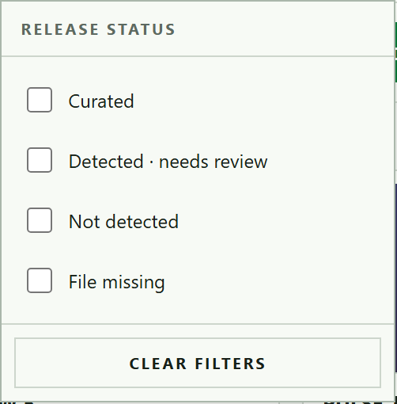

*Status filters. Combine them freely — Curated plus Not detected shows both.*

The list view is denser and shows kept and rejected counts on one line, which is
useful when working through a backlog.

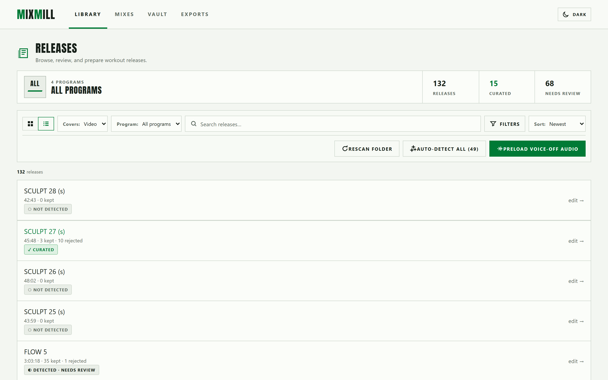

## 5. Detect tracks

Open a release and select **Auto-detect tracks**.

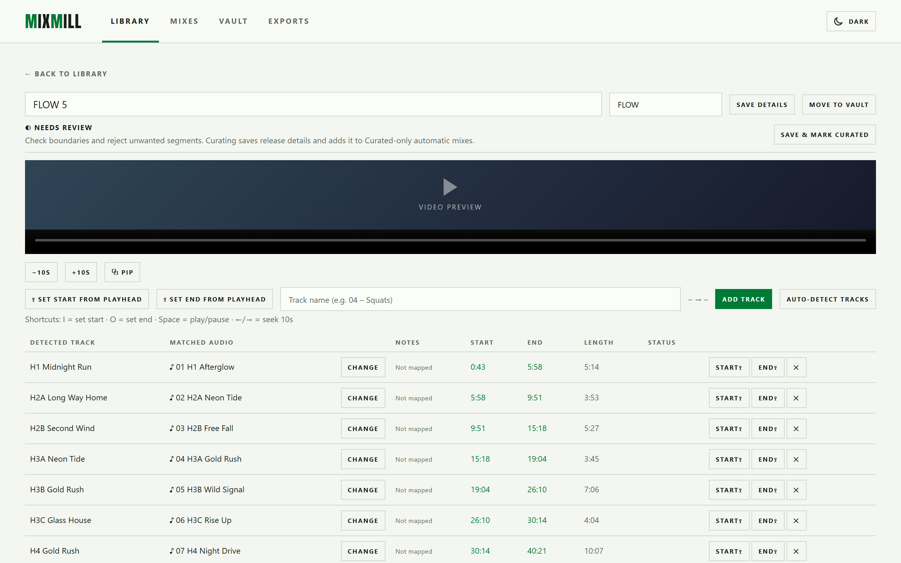

MixMill tries these methods:

1. Read chapter markers embedded in the video.
2. If the video has no chapters, compare music files with the video's audio.

Track codes such as `H1`, `H2A`, and `B2B` are recognized in chapter names,
music filenames, and choreography headings. A leading music-file order such as
`02 H2A` does not replace the real `H2A` track code.

Detection may take time because MixMill must analyze media. Leave the app open
until the job finishes.

Running Auto-detect again is safe in MixMill 1.0.1 and newer. It does not create
another set of chapter segments.

**Auto-detect all** at the top of the Library runs the same job across every
release that has no tracks yet. It is the fastest way to start a large library,
but review the results release by release afterwards.

## 6. Review a release

Do not mark a release Curated without checking it.

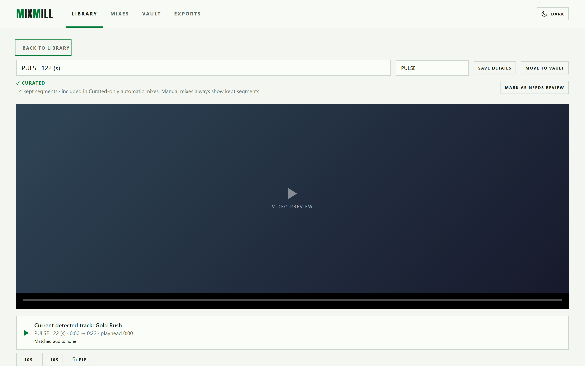

*Player on top, detected tracks underneath. The green row is the segment playing
right now.*

For each segment:

1. Play near the start.
2. Confirm that the track begins at the shown time.
3. Play near the end.
4. Confirm that the track ends at the shown time.
5. Correct the name, start, or end when needed.
6. Check the matched music file. Select **Choose** or **Change** beside it to
   fix the match for this release and every mix that uses the track. Select
   **Auto · by track number** to restore automatic matching. A song chosen
   inside one mix remains that mix's override.
7. Check the mapped choreography pages when a PDF exists.

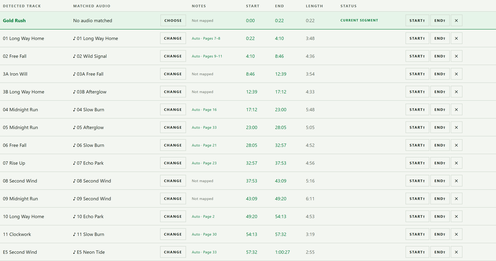

*Each row: detected track, matched audio, notes pages, start, end, length,
status. **Start⇥** and **End⇥** write the playhead into that row.*

Keyboard shortcuts help during review:

- `Space` — play or pause
- `Left Arrow` / `Right Arrow` — seek 10 seconds
- `I` — set start from the playhead
- `O` — set end from the playhead

### Music

The Music section lists every song MixMill found in the release folder. Play any
of them to compare a song against the video audio before accepting a boundary.

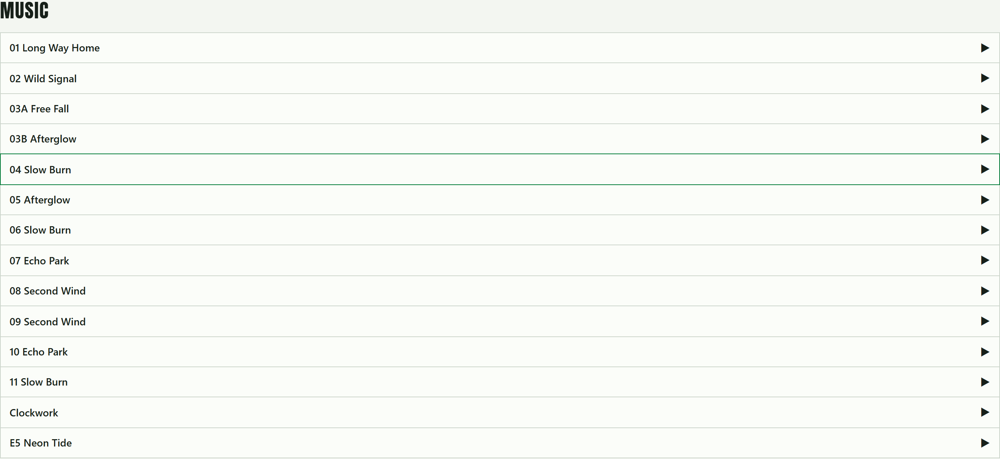

### Choreography notes

Open **Choreography notes** to see which PDF pages belong to each track.

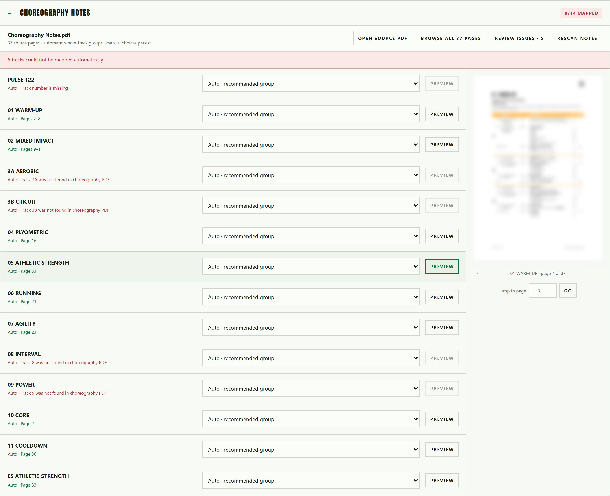

*Automatic mappings are labeled `Auto`. Red text explains why a track has no
pages. **Preview** shows the page on the right, and **Review issues** filters the
list down to the tracks that need attention.*

Change a mapping with the dropdown beside a track. Manual choices persist
through later rescans.

## 7. Understand states

### Needs review

MixMill found the release or detected segments, but you have not confirmed their
names and boundaries yet.

### Curated

You reviewed the release and confirmed its tracks. Curated is the safe default
for automatic mix generation. It does not hide unreviewed releases from manual
mixes.

### Rejected segments

Rejected segments are unwanted database records, not media files. They stay out
of normal mixes.

Use Rejected as a recycle bin when you may want to restore a segment. Permanently
delete a rejected segment only when you are certain it is unnecessary.

### Vault

**Move to vault** parks a release: it disappears from the Library, the mix picker
and the generator, but mixes that already use it keep working. **Unvault**
returns it.

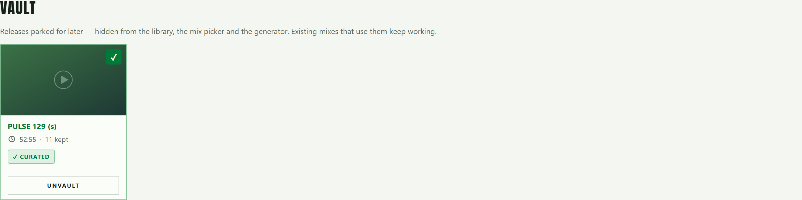

## 8. Create a mix manually

1. Open **Mixes**.
2. Select **Create empty mix**.
3. Give the mix a clear name.
4. Add tracks from the picker.
5. Preview tracks before adding them when needed.
6. Move tracks into the correct order.
7. Remove anything you do not want.
8. Play the mix inside MixMill before exporting it.

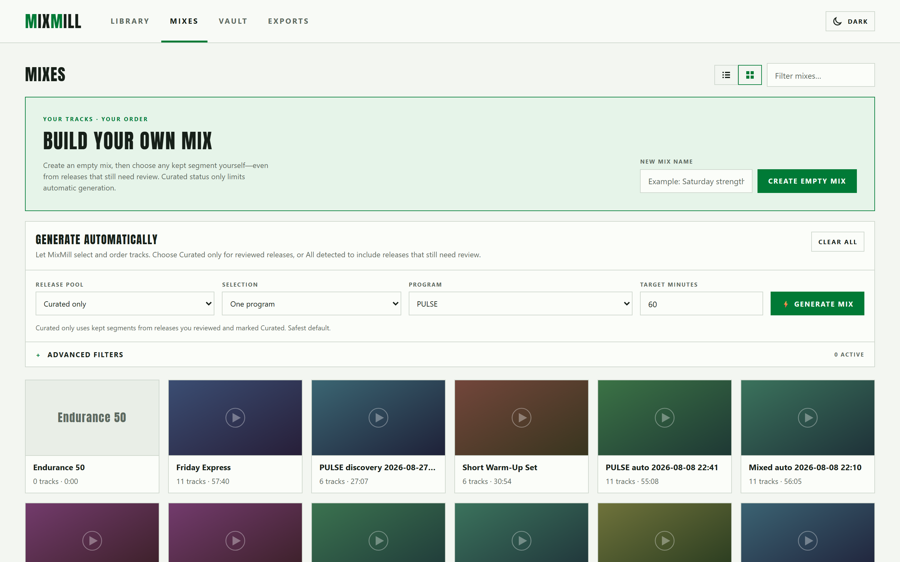

*Build your own mix on top, the generator underneath, existing mixes below.*

Creating or editing a mix is instant because MixMill stores references to the
original videos. It does not create a new video until export.

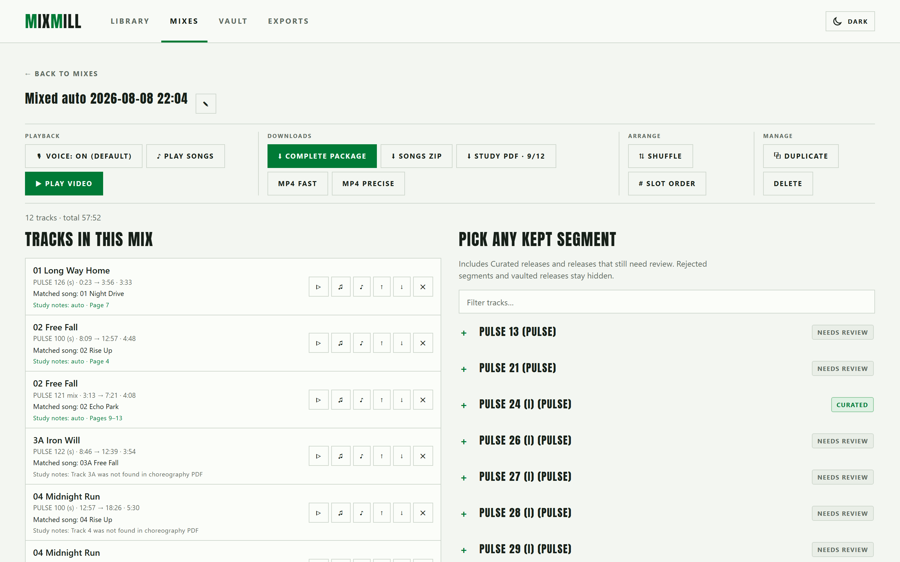

*Mix contents on the left, the segment picker on the right. Each row shows the
source release, the timing, and the matched song.*

The manual picker shows every kept segment from both Curated releases and
releases that still need review. Rejected segments and vaulted releases stay
hidden. Curated status only limits automatic generation.

## 9. Generate a mix automatically

1. Open the mix generator.
2. Choose one program or use the mixed-program option.
3. Choose the target duration.
4. Keep **Curated only** selected for reviewed releases, or choose **All
   detected** to include numbered kept segments from releases that still need
   review. Choose **Everything** to also allow rejected segments and Vault
   releases. Missing files and unnumbered sections remain unavailable.
5. Use advanced filters only when needed.
6. Generate the mix.
7. Review, reorder, replace, or remove tracks.

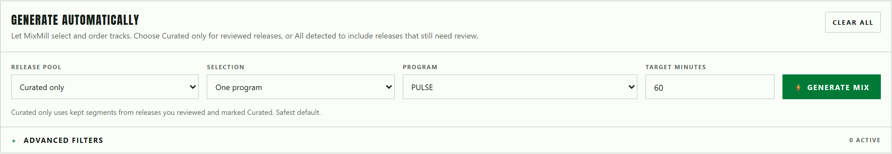

Generated mixes are suggestions. Always review them before teaching or sharing.
You can remove any generated track and replace it from the picker on the right.
Curated releases are labeled there, making reviewed replacements easy to find.

Automatic mixes are named after the pool and the moment they were made, such as
`Mixed auto 2026-08-08 22:04`. Rename a mix with the pencil button beside its
title.

### Advanced filters

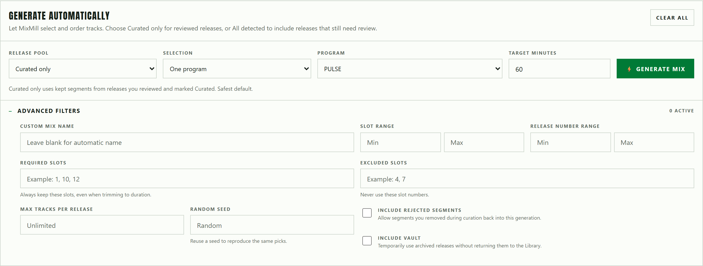

*Restrict the track numbers or release numbers used, force or exclude specific
slots, cap how many tracks come from one release, or reuse a seed to repeat an
earlier result.*

Leave every advanced field empty until a generated mix disappoints you. Each
filter shrinks the pool MixMill can choose from.

### Voice-Off audio

The player uses a release's second audio stream as its music-only Voice-Off
track. **Preload Voice-Off Audio** extracts and caches that stream for every
non-vaulted release so Voice Off starts instantly later. MixMill skips releases
that contain only one audio stream. Originals stay unchanged.

## 10. Export and download

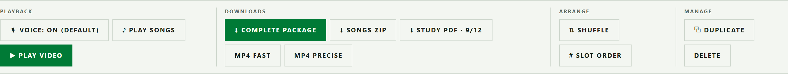

*Playback, Downloads, Arrange, and Manage. Exports start from the Downloads
group.*

### Fast export

Fast export copies the original video streams without fully converting them. It
usually finishes much sooner. Because video cuts must begin at keyframes, a
small lead-in before the chosen start time is possible.

### Precise export

Precise export converts every segment. It takes longer but produces exact cuts
and handles source videos with different formats or resolutions more reliably.

### Download choices

Depending on available source files, MixMill can download:

- Finished MP4 mix
- Matched music ZIP
- Choreography study PDF
- Complete package with video, study PDF, matched music, and a coverage report

The Windows app opens a normal **Save As** window. Choose the destination folder
and filename there.

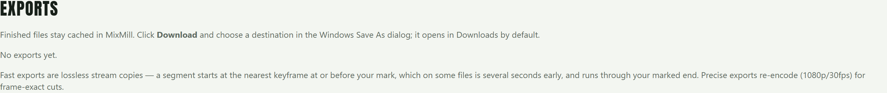

*Finished files stay cached until downloaded.*

## 11. Where MixMill saves data

The Windows app stores its own data here:

```text
%LOCALAPPDATA%\MixMill
```

This includes:

- Settings
- Track boundaries
- Mixes
- Rejected segments
- Database backups
- Thumbnail and audio caches
- Completed exports
- Logs

Updating or uninstalling MixMill preserves this folder. Your original media
library remains in the folder you selected.

## 12. Common problems

### A release does not appear

- Confirm that its video uses a supported extension.
- Confirm that you selected the top-level library folder.
- Select **Rescan folder** again.

### Music does not match

- Put music inside a subfolder of the release folder.
- Start filenames with track numbers such as `01`, `02`, and `03A`.
- Confirm that the music belongs to the same release video.
- Set boundaries manually when the class audio differs too much from the music
  file.

### Choreography notes do not match

- Put the PDF beside the release video.
- Prefer a filename containing `Choreography` or `Choreo`.
- Open the mapping studio and choose the correct page range manually.

### Duplicate-looking tracks appear

First confirm that you use MixMill 1.0.1 or newer. Old versions could create a
second set of database segments when Auto-detect ran more than once on a video
that already contained chapters.

Duplicate segments are not duplicate files. Move unwanted segments to Rejected,
then permanently delete them after confirming the correct set remains active.

### Download appears to do nothing

Check for a Windows **Save As** window behind the MixMill window. Finished
exports also remain cached under `%LOCALAPPDATA%\MixMill\data\exports`.

## Need help?

Read [SUPPORT.md](../SUPPORT.md) before opening an issue. Include the MixMill
version, Windows version, what you clicked, what you expected, and what happened.
Never upload copyrighted workout media to a public issue.

---

**About the screenshots.** They come from a real library, but program names,
release titles, song names, covers, video frames and choreography pages are
replaced with neutral placeholders. `tools/docs_screenshots.py` regenerates them
and `tools/docs_demo_skin.js` does the replacing.
